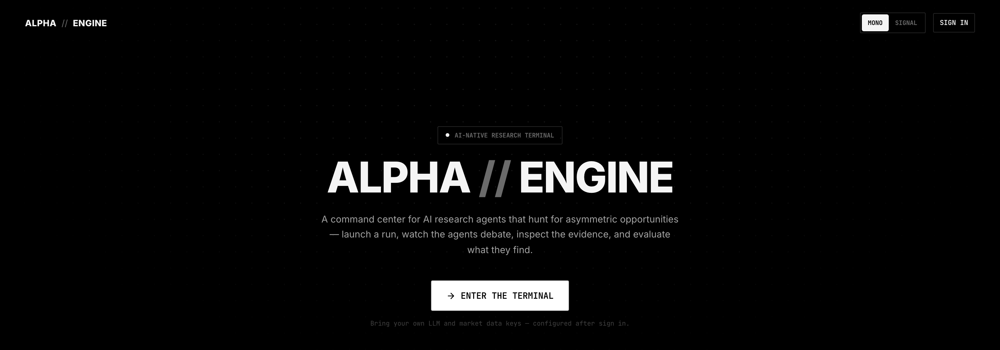
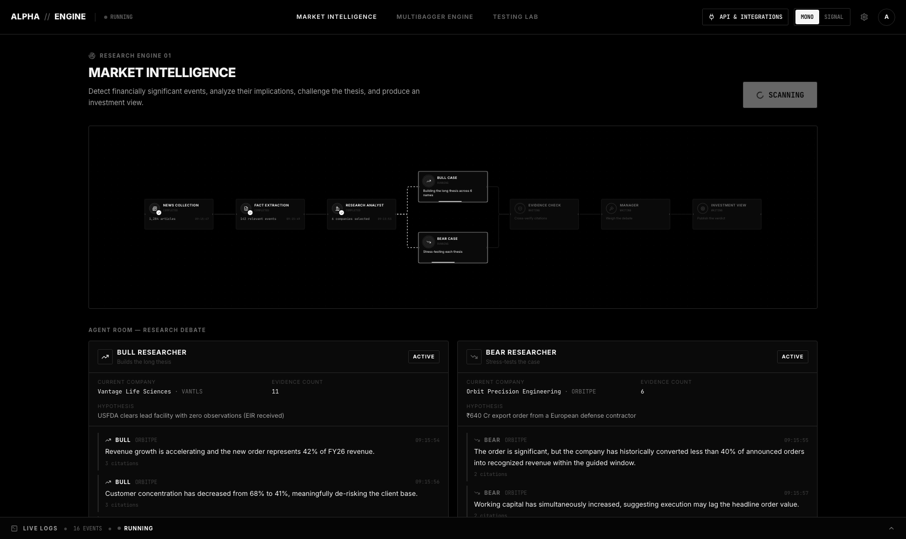
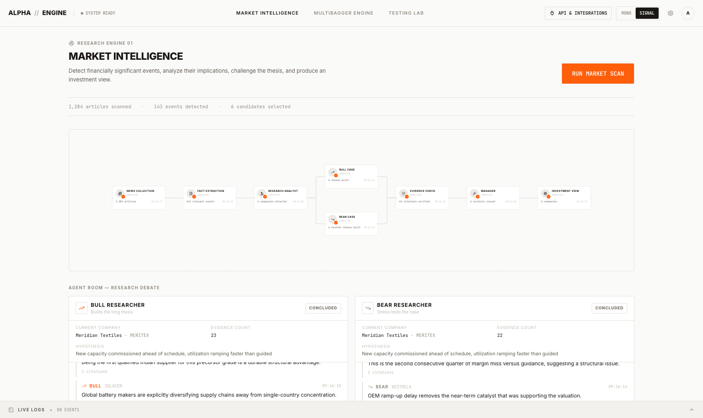
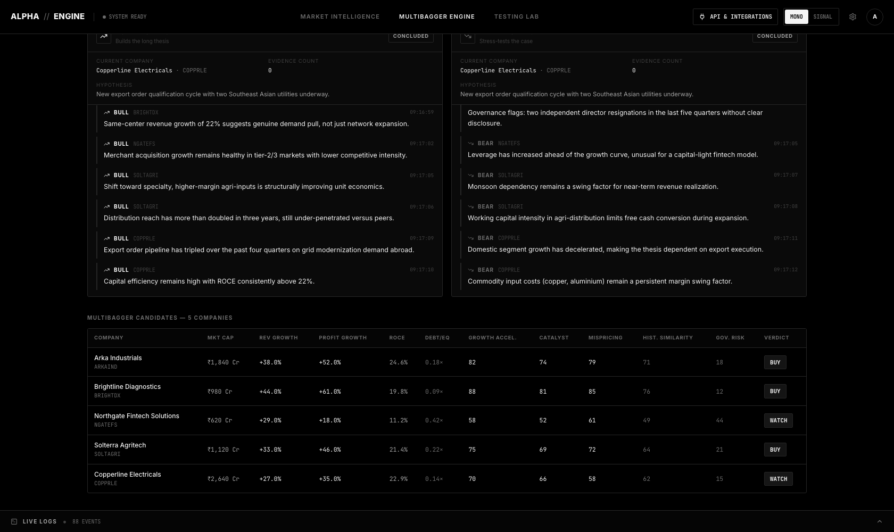
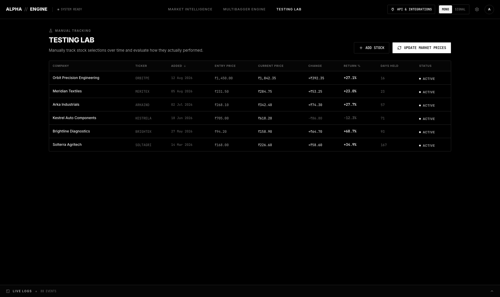
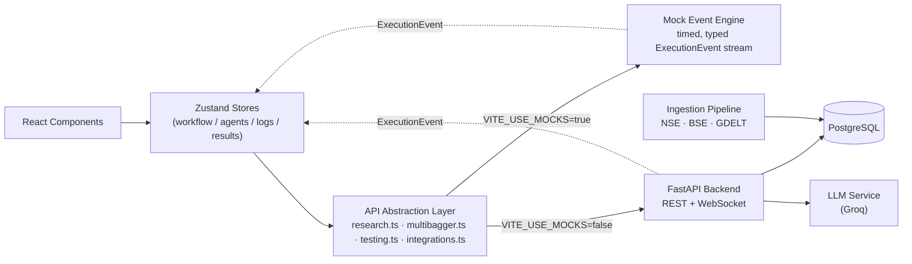
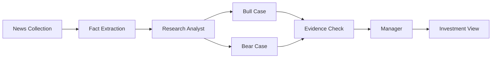

<div align="center">



<br/>

**An AI-native research terminal for hunting asymmetric opportunities.**
<br/>
Launch a research run. Watch the agents debate. Inspect the evidence. Judge the thesis yourself.

<br/>

[](frontend)
[](frontend)
[](backend)
[](backend)
[]()
[]()

</div>

<br/>

```text
$ SYSTEM STATUS
> READY
> THEME .......... MONO / SIGNAL
> DATA MODE ...... LIVE (NSE · BSE · GDELT ingestion) or DEMO (deterministic mock engine)
> ENGINES ........ MARKET_INTELLIGENCE · MULTIBAGGER · TESTING_LAB
```

<br/>

---

## What this is

**ALPHA // ENGINE** is not a dashboard. It's a control surface for a swarm of AI research agents — the kind of interface a
quant desk would actually want on their second monitor. You press run, and the system comes alive: news gets ingested,
a research analyst screens candidates, a **Bull** and a **Bear** agent argue over the same evidence in real time, a
**Manager** weighs the debate and issues a verdict, and you're left with a structured, evidence-backed investment view —
not a black box.

The product ships in two flavors of the same design system: a **strict black-and-white terminal** and a **white/orange
research-desk** theme, both built on the same token set so the whole UI repaints consistently on toggle.

This repository contains **both halves of the product**: a complete React/TypeScript frontend, and a Python/FastAPI
backend that ingests NSE, BSE, and GDELT data into PostgreSQL and drives the research pipelines behind it. The frontend
was architected from day one to snap onto the backend over REST + WebSockets with zero component-level rewrites — it
can also run entirely on a deterministic, fully-typed mock event engine, so the product is demoable end-to-end with no
backend, database, or API keys at all.

<br/>

---

## See it running

<table>
<tr>
<td width="50%"><br/><sub align="center">Bull vs. Bear agents debating live evidence — MONO theme</sub></td>
<td width="50%"><br/><sub>Same run, SIGNAL theme — one token set, two looks</sub></td>
</tr>
<tr>
<td width="50%"><br/><sub>Multibagger Engine — screened candidates with a Judge verdict</sub></td>
<td width="50%"><br/><sub>Testing Lab — tracking your own picks against reality</sub></td>
</tr>
</table>

<sub>More screenshots in [`docs/screenshots/`](docs/screenshots).</sub>

<br/>

---

## Three engines, one terminal

| Engine | What it does |
|---|---|
| **Market Intelligence** | Detects financially significant events, builds a Bull case and a Bear case in parallel, cross-verifies the evidence, and has a Manager agent issue a `BUY` / `WATCH` / `PASS` verdict with explicit invalidation conditions. |
| **Multibagger Engine** | Screens for small companies where future earning power may be materially larger than the current valuation implies — quality filters → growth inflection → catalyst detection → future value modeling → historical pattern matching → a final Judge score. |
| **Testing Lab** | Manually track your own stock picks from the date you added them. Auto-fetches entry price, tracks performance over time, and charts the price history from entry to today. |

Every run is visualized as a live execution graph — nodes pulse while running, complete with a timestamp and result
count, and the whole thing streams into a collapsible, filterable **live log console** at the bottom of the screen,
exactly like a build pipeline.

<br/>

---

## Architecture

The frontend is built around a single idea: **the UI never manages its own fake timers.** Every state transition —
a workflow node going from `waiting` to `running` to `completed`, an agent message arriving, a log line appearing —
is the result of feeding a strongly-typed `ExecutionEvent` into a store reducer. Those events come from either a
deterministic mock engine or a live WebSocket from the backend — the component tree doesn't know the difference.



A single research run looks like this under the hood:



**Design principles that shaped it:**
- **No scattered `fetch` calls.** Every domain (`research`, `multibagger`, `testing`, `integrations`) has its own
  service in `frontend/src/api/`, all routed through one `client.ts`.
- **Mock data is isolated, not hard-coded.** Realistic fixtures live in `frontend/src/mock/`, never inline in
  components — the mock engine and the real backend implement the exact same `ExecutionEvent` contract.
- **Secrets never touch localStorage.** Provider API keys are sent to the backend and only ever redisplayed masked
  (`••••••••9A21`). Only non-sensitive UI state (theme, mock session profile) is persisted client-side.
- **One design-token system, two themes.** Every color in the app is a CSS custom property; the `MONO` and `SIGNAL`
  themes are just two value sets swapped on `<html data-theme>`.
- **Sources fail independently.** NSE, BSE, and GDELT are ingested in parallel; one source failing doesn't block the
  others or crash the run — it's recorded as a partial result, not silently dropped.

<br/>

---

## Tech stack

| Layer | Choice |
|---|---|
| UI | React 19 + TypeScript (strict) |
| Styling | Tailwind CSS v4, CSS custom-property design tokens |
| State | Zustand (one store per domain) |
| Motion | Framer Motion |
| Workflow graph | React Flow |
| Charts | Recharts |
| Icons | Lucide |
| Frontend build | Vite 8 · oxlint |
| Backend | FastAPI + SQLAlchemy 2.0 + Pydantic v2 |
| Database | PostgreSQL |
| LLM | Groq (behind an internal `llm_service` interface) |
| Data sources | NSE, BSE, GDELT (independent ingestion, deduped + upserted) |
| Backend tests | pytest + pytest-asyncio, fixture-driven (no live network calls) |

<br/>

---

## Getting started

### Frontend (demo mode — no backend required)

```bash
git clone https://github.com/Niket420/Agentic-TraderR.git
cd Agentic-TraderR/frontend
npm install
npm run dev
```

Open the URL Vite prints (defaults to `http://localhost:5173`). With `VITE_USE_MOCKS=true` (the default), the app
runs entirely in **demo mode** — no backend, no database, no API keys needed to explore every screen.

```bash
npm run build   # type-check + production build
npm run lint    # oxlint
npm run preview # preview the production build locally
```

### Backend (live mode)

```bash
cd backend
python3 -m venv .venv
source .venv/bin/activate
pip install -r requirements.txt

createdb agentictrader          # local Postgres must be running
cp .env.example .env            # fill in GROQ_API_KEY if you have one

uvicorn app.main:app --reload --port 8000
```

Tables are created automatically on startup — no migration step for this phase. Then point the frontend at it with
`frontend/.env.local`:

```
VITE_USE_MOCKS=false
VITE_API_BASE_URL=http://localhost:8000/api
VITE_WS_BASE_URL=ws://localhost:8000/api
```

Run the backend tests with:

```bash
createdb agentictrader_test
pytest tests/ -v
```

### Environment variables

| Variable | Where | Default | Purpose |
|---|---|---|---|
| `VITE_USE_MOCKS` | frontend | `true` | Set to `false` once the backend is live — every API service switches from the mock engine to real HTTP/WebSocket calls with no component changes. |
| `VITE_API_BASE_URL` | frontend | `/api` | Base URL for REST calls. |
| `VITE_WS_BASE_URL` | frontend | derived from API base | Base URL for the live execution event stream. |
| `DATABASE_URL` | backend | — | PostgreSQL connection string. |
| `GROQ_API_KEY` | backend | — | Enables LLM-backed research steps; optional for ingestion-only use. |
| `CORS_ORIGINS` | backend | `http://localhost:5173` | Allowed origins for the Vite dev server. |
| `LOG_LEVEL` | backend | `INFO` | Backend log verbosity. |

<br/>

---

## Project structure

```
frontend/src/
├── api/            # Domain services (research, multibagger, testing, integrations) + base client
├── components/      # shell, workflow, agents, manager, results, multibagger, testing, console, common
├── lib/             # formatters, workflow layout definitions, small utilities
├── mock/            # mock fixtures + the timed ExecutionEvent playback engine
├── pages/           # top-level screens (Landing, Login, three engine pages)
├── store/           # Zustand stores — theme, nav, auth, logs, research, multibagger, testing, integrations
└── types/           # shared domain types, incl. the ExecutionEvent union

backend/app/
├── api/routes/      # research, multibagger, testing, integrations, auth, data (admin)
├── data_sources/    # nse/, bse/, gdelt/ — source-specific ingestion, cookies, rate limits
├── models/          # SQLAlchemy models
├── pipelines/        # ingestion.py, research.py, multibagger.py
├── schemas/         # Pydantic request/response schemas
├── services/        # llm/, research/, financials/, market_data/, announcements/, news/, companies/
├── ws/              # WebSocket ExecutionEvent streaming
└── core/            # settings, db session, shared config
```

<br/>

---

## Roadmap

- [x] Python backend: REST endpoints matching the `api/` layer's contract 1:1
- [x] NSE + BSE + GDELT ingestion pipeline into PostgreSQL
- [x] Real WebSocket event stream alongside the mock engine
- [ ] Full Bull/Bear/Manager multi-agent pipeline (current pipelines are thin, intentional placeholders — see
      [`backend/README.md`](backend/README.md))
- [ ] XBRL parsing for real financial figures (Multibagger growth metrics are currently placeholders)
- [ ] Persistent run history and multi-run comparison
- [ ] Experiment tracking in the Testing Lab (group multiple picks under one thesis)
- [ ] Route-level code splitting on the frontend
- [ ] Mobile-optimized workflow timeline view

<br/>

---

## License

No license has been added yet — all rights reserved by default until one is chosen.

<br/>

---

<div align="center">

<sub>Built as a research terminal, not a dashboard. Every screen answers: what is happening right now?</sub>

<br/>
<br/>

<sub>ALPHA <b>//</b> ENGINE</sub>

</div>
