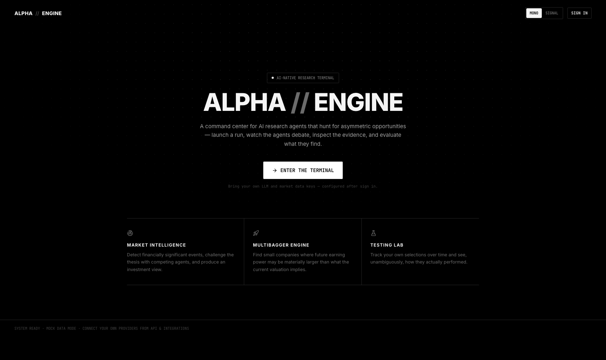
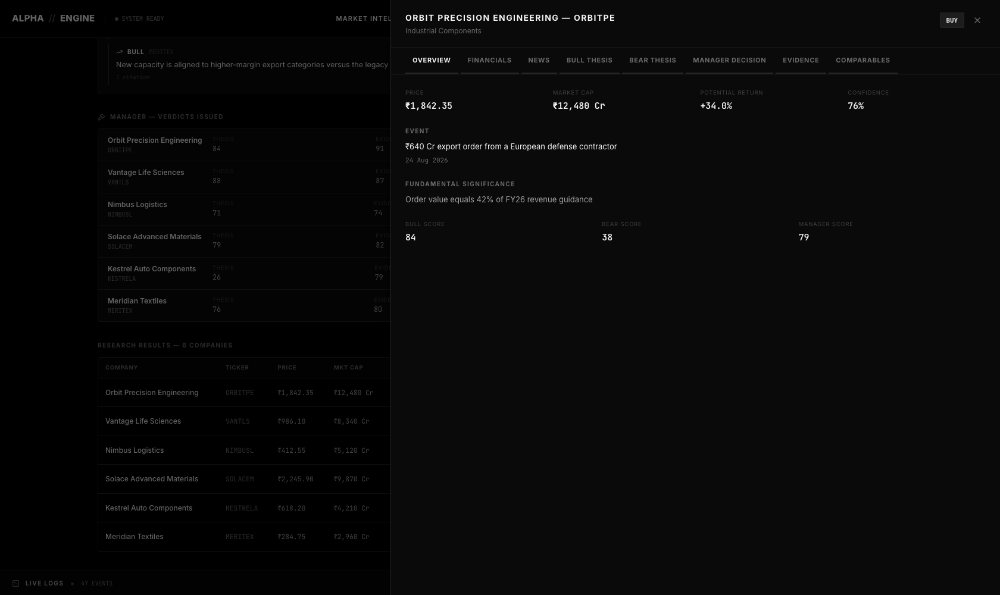
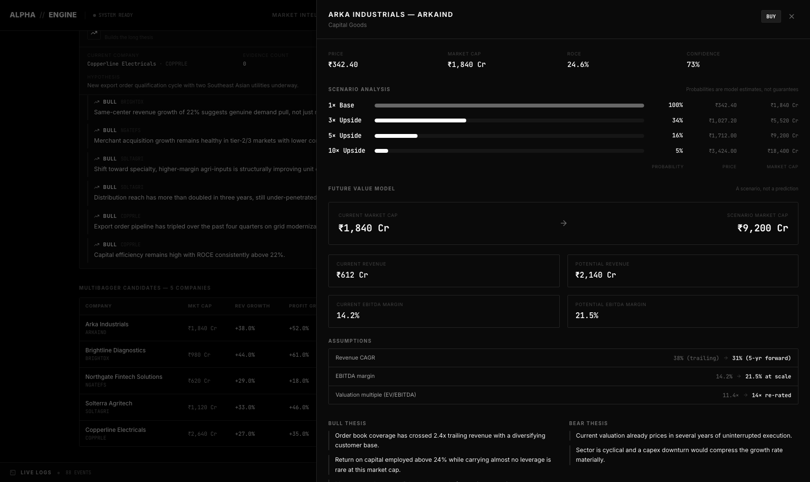
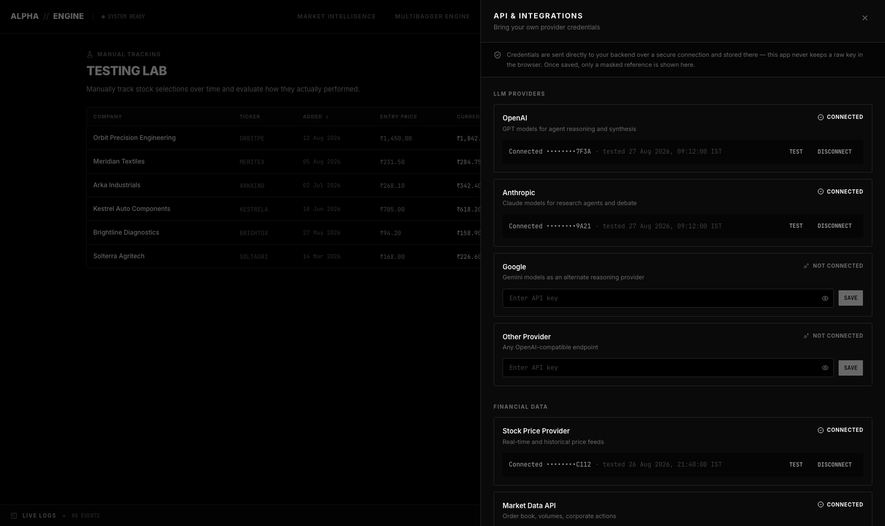
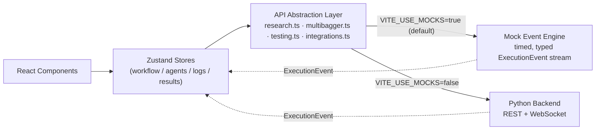
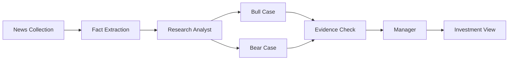

<div align="center">

# ALPHA // ENGINE

**An AI-native research terminal for hunting asymmetric opportunities.**

Launch a research run. Watch the agents debate. Inspect the evidence. Judge the thesis yourself.

[](https://react.dev)
[](https://www.typescriptlang.org/)
[](https://tailwindcss.com/)
[](https://vitejs.dev/)
[](https://github.com/pmndrs/zustand)
[]()

</div>

<br/>

<p align="center">
  
</p>

<br/>

## What this is

**ALPHA // ENGINE** is not a dashboard. It's a control surface for a swarm of AI research agents — the kind of interface a
quant desk would actually want on their second monitor. You press run, and the system comes alive: news gets ingested,
a research analyst screens candidates, a **Bull** and a **Bear** agent argue over the same evidence in real time, a
**Manager** weighs the debate and issues a verdict, and you're left with a structured, evidence-backed investment view —
not a black box.

The product ships in two flavors of the same design system: a **strict black-and-white terminal** and a **white/orange
research-desk** theme, both built on the same token set so the whole UI repaints consistently on toggle.

This repository currently contains the **complete frontend** — architected from day one to snap onto a real Python
backend over REST + WebSockets, with zero component-level rewrites required. Until that backend exists, every run is
driven by a deterministic, fully-typed mock event engine so the product is demoable end-to-end today.

<br/>

## Screens

<table>
<tr>
<td width="50%"></td>
<td width="50%"></td>
</tr>
<tr>
<td align="center"><sub>Live run — horizontal workflow graph + Bull/Bear <b>Agent Room</b></sub></td>
<td align="center"><sub>Deep research panel — thesis, evidence, comparables, manager verdict</sub></td>
</tr>
<tr>
<td width="50%"></td>
<td width="50%"></td>
</tr>
<tr>
<td align="center"><sub><b>Multibagger Engine</b> — 1×/3×/5×/10× scenario &amp; future value modeling</sub></td>
<td align="center"><sub>The <b>SIGNAL</b> theme — same system, white ground, orange accent</sub></td>
</tr>
<tr>
<td width="50%"></td>
<td width="50%"></td>
</tr>
<tr>
<td align="center"><sub><b>Testing Lab</b> — track your own calls, see what actually happened</sub></td>
<td align="center"><sub>Bring-your-own-keys, masked after save, never persisted in the browser</sub></td>
</tr>
</table>

<br/>

## Three engines, one terminal

| Engine | What it does |
|---|---|
| **Market Intelligence** | Detects financially significant events, builds a Bull case and a Bear case in parallel, cross-verifies the evidence, and has a Manager agent issue a `BUY` / `WATCH` / `PASS` verdict with explicit invalidation conditions. |
| **Multibagger Engine** | Screens for small companies where future earning power may be materially larger than the current valuation implies — quality filters → growth inflection → catalyst detection → future value modeling → historical pattern matching → a final Judge score. |
| **Testing Lab** | Manually track your own stock picks from the date you added them. Auto-fetches entry price, tracks performance over time, and charts the price history from entry to today. |

Every run is visualized as a live execution graph — nodes pulse while running, complete with a timestamp and result
count, and the whole thing streams into a collapsible, filterable **live log console** at the bottom of the screen,
exactly like a build pipeline.

<br/>

## Architecture

The frontend is built around a single idea: **the UI never manages its own fake timers.** Every state transition —
a workflow node going from `waiting` to `running` to `completed`, an agent message arriving, a log line appearing —
is the result of feeding a strongly-typed `ExecutionEvent` into a store reducer. Today those events come from a
deterministic mock engine; tomorrow they come from a WebSocket. The component tree doesn't know the difference.



A single research run looks like this under the hood:



**Design principles that shaped it:**
- **No scattered `fetch` calls.** Every domain (`research`, `multibagger`, `testing`, `integrations`) has its own
  service in `src/api/`, all routed through one `client.ts`.
- **Mock data is isolated, not hard-coded.** Realistic fixtures live in `src/mock/`, never inline in components —
  swapping to a real backend means deleting a folder, not hunting through JSX.
- **Secrets never touch localStorage.** Provider API keys are sent to the backend and only ever redisplayed masked
  (`••••••••9A21`). Only non-sensitive UI state (theme, mock session profile) is persisted client-side.
- **One design-token system, two themes.** Every color in the app is a CSS custom property; the `MONO` and `SIGNAL`
  themes are just two value sets swapped on `<html data-theme>`.

<br/>

## Tech stack

| Layer | Choice |
|---|---|
| UI | React 19 + TypeScript (strict) |
| Styling | Tailwind CSS v4, CSS custom-property design tokens |
| State | Zustand (one store per domain) |
| Motion | Framer Motion |
| Workflow graph | React Flow |
| Charts | Recharts |
| Icons | Lucide |
| Build | Vite 8 |
| Lint | oxlint |

<br/>

## Getting started

```bash
git clone https://github.com/Niket420/Agentic-TraderR.git
cd Agentic-TraderR/frontend
npm install
npm run dev
```

Open the URL Vite prints (defaults to `http://localhost:5173`). The app runs entirely in **demo mode** out of the box —
no backend required, no API keys needed to explore every screen.

```bash
npm run build   # type-check + production build
npm run lint    # oxlint
npm run preview # preview the production build locally
```

### Environment variables

| Variable | Default | Purpose |
|---|---|---|
| `VITE_USE_MOCKS` | `true` | Set to `false` once a real backend is live — every API service switches from the mock engine to real HTTP/WebSocket calls with no component changes. |
| `VITE_API_BASE_URL` | `/api` | Base URL for REST calls. |
| `VITE_WS_BASE_URL` | derived from API base | Base URL for the live execution event stream. |

<br/>

## Project structure

```
frontend/src/
├── api/            # Domain services (research, multibagger, testing, integrations) + base client
├── components/      # shell, workflow, agents, manager, results, multibagger, testing, console, common
├── lib/             # formatters, workflow layout definitions, small utilities
├── mock/            # mock fixtures + the timed ExecutionEvent playback engine
├── pages/           # top-level screens (Landing, Login, three engine pages)
├── store/           # Zustand stores — theme, nav, auth, logs, research, multibagger, testing, integrations
└── types/           # shared domain types, incl. the ExecutionEvent union
```

<br/>

## Roadmap

- [ ] Python backend: REST endpoints matching the `api/` layer's contract 1:1
- [ ] Real WebSocket event stream replacing the mock engine
- [ ] Persistent run history and multi-run comparison
- [ ] Experiment tracking in the Testing Lab (group multiple picks under one thesis)
- [ ] Route-level code splitting (current bundle is a single ~280KB gzipped chunk)
- [ ] Mobile-optimized workflow timeline view

<br/>

## License

No license has been added yet — all rights reserved by default until one is chosen.

<br/>

<div align="center">
<sub>Built as a research terminal, not a dashboard. Every screen answers: what is happening right now?</sub>
</div>
